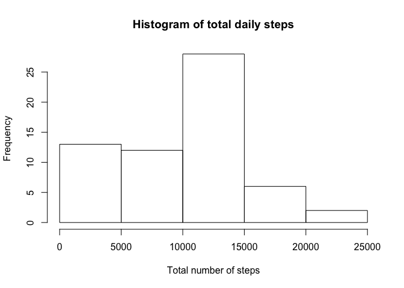
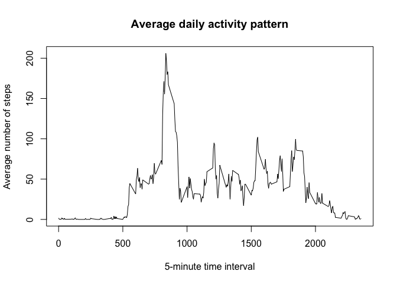
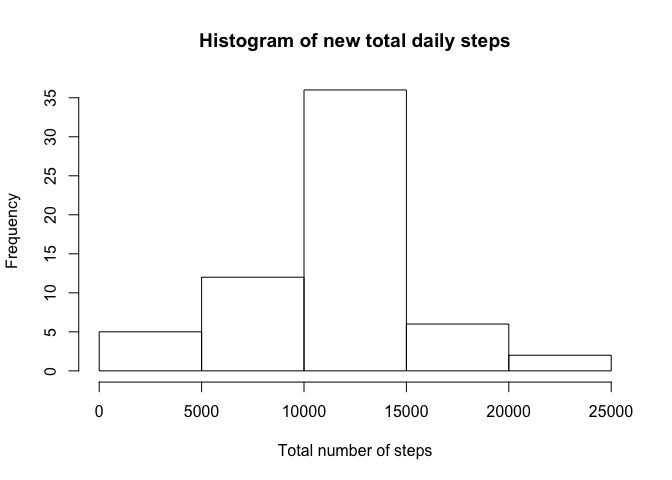
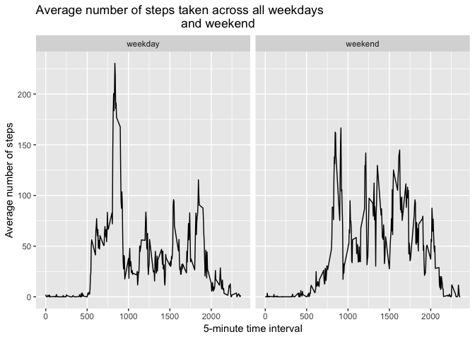

## Introduction
This assignment makes use of data from a personal activity monitoring
device. This device collects data at 5 minute intervals throughout the
day. The data consists of two months of data from an anonymous
individual collected during the months of October and November, 2012
and includes the number of steps taken in 5 minute intervals each day.

The data for this assignment is downloaded from the course web
site:

* Data set: [Activity monitoring data](https://d396qusza40orc.cloudfront.net/repdata%2Fdata%2Factivity.zip) [52K]

## Loading and preprocessing data
Throughout the `R` code in this report it is assumed that the data resides in
the working directory. 

We first load the data in the workplace and check out the data structure with
`str`. Any transformation of data will be done when necessary later in the
project.


```r
mydata <- read.csv("./activity.csv")
str(mydata)
```

```
## 'data.frame':	17568 obs. of  3 variables:
##  $ steps   : int  NA NA NA NA NA NA NA NA NA NA ...
##  $ date    : Factor w/ 61 levels "2012-10-01","2012-10-02",..: 1 1 1 1 1 1 1 1 1 1 ...
##  $ interval: int  0 5 10 15 20 25 30 35 40 45 ...
```

### What is mean total number of steps taken per day?

For this part of the assignment, we ignore the missing values in
the data set. 

**NB:** The observations with missing values are **NOT** filtered out during
the calculations. This choice leads to the missing values being taken as zero
(during the `sum` operation), which causes the `mean` and `median` values to be
smaller, because there are whole days with `NA` values. Since we want to be
consistent and keep the number of days of observations at `61` for our
calculations, we chose this approach.


```r
library(dplyr)
```

```
## 
## Attaching package: 'dplyr'
```

```
## The following objects are masked from 'package:stats':
## 
##     filter, lag
```

```
## The following objects are masked from 'package:base':
## 
##     intersect, setdiff, setequal, union
```

```r
library(ggplot2)
```


```r
# calculate the daily total steps
dailySteps <- mydata %>% group_by(date) %>% summarize(totalSteps = sum(steps, na.rm = TRUE))

# plot the histogram of total steps
hist(dailySteps$totalSteps, main = "Histogram of total daily steps", xlab = "Total number of steps" )
```

<!-- -->

```r
# check out the mean, median and minimum values for daily total steps
summary(dailySteps$totalSteps)
```

```
##    Min. 1st Qu.  Median    Mean 3rd Qu.    Max. 
##       0    6778   10395    9354   12811   21194
```

With the choice we made about the missing values, the `mean` total number of
steps taken daily is `9354` and the `median` is `10395`. If we had filtered out
the observations that had missing values, then the results would be *different*
as shown below.


```r
# calculate the daily total steps
dailySteps2 <- mydata %>% group_by(date) %>% filter(!is.na(steps)) %>%
    summarize(totalSteps = sum(steps))

# check out the mean, median and minimum values for daily total steps
summary(dailySteps2$totalSteps)
```

```
##    Min. 1st Qu.  Median    Mean 3rd Qu.    Max. 
##      41    8841   10765   10766   13294   21194
```

In this case we only have `53` days instead of `61` (i.e. there were `8` days
with no observations in the original data set), so the `median` and `mean`
values are higher.

### What is the average daily activity pattern?

We need to make a time series plot (i.e. `type = "l"`) of the 5-minute interval
(x-axis) and the average number of steps taken, averaged across all days
(y-axis).


```r
timeSeries <- mydata %>% group_by(interval) %>% summarize(averageStep =
        mean(steps, na.rm = TRUE))
plot(timeSeries$interval, timeSeries$averageStep, type='l', 
     main = "Average daily activity pattern", 
     xlab = "5-minute time interval", ylab = "Average number of steps")
```

<!-- -->

```r
# which 5-min interval on average across all days has maximum steps?
timeSeries[which.max(timeSeries$averageStep),]
```

```
## # A tibble: 1 x 2
##   interval averageStep
##      <int>       <dbl>
## 1      835        206.
```

```r
# to check to which actual time interval a certain time interval belongs to
newInterval <- function(x) {
    if (nchar(x) == 1) {
        y <- paste("00:0", x, sep = "")
    }
    else if (nchar(x) == 2) {
        y <- paste("00:", x, sep = "")
    }
    else if (nchar(x) == 3) {
        x1 <- paste("0", substr(x,1,1), sep = "") 
        x2 <- paste(x1, ":", sep = "") 
        y <- paste(x2, substr(x,2,3), sep = "")
    }
    else if (nchar(x) == 4) {
        x1 <- paste(substr(x,1,2), ":", sep = "")
        y <- paste(x1, substr(x,3,4), sep = "")
    }
    return(y)
}

# let us tell the interval that has the maximum number of steps in average
newInterval(as.character(timeSeries$interval[
                                         which.max(timeSeries$averageStep)]))
```

```
## [1] "08:35"
```

The 5-minute interval, on average across all the days in the data set, that
contains the maximum number of steps is the interval that starts at `08:35`. 

### Imputing missing values

We have already noticed that there are a number of days/intervals where there
are missing values (coded as `NA`). The presence of missing days may introduce
bias into some calculations or summaries of the data as we have pointed out
above.

Let us calculate what is the total number of observations (i.e. rows) 
in the data set that have missing values (i.e. `NA`s).


```r
noStepsData <- sum(is.na(mydata$steps))
```

So, a total of 2304 rows are missing data. 

We need to devise a strategy for filling in all of the missing values in the
data set. We will use the `mean` value for that 5-minute interval, where the
`mean` is *calculated by filtering out the missing value rows*. With these new
values we will create a new data set with no missing values.


```r
# filter out the missing value rows and calculate the means for each interval
intervalMeans <-  mydata %>% group_by(interval) %>% filter(!is.na(steps)) %>%
    summarize(meanSteps = mean(steps))

#create new data set replacing the NAs with interval means
temp <- merge(mydata, intervalMeans, by = "interval", sort=FALSE)   
newData <- temp %>% mutate(steps = ifelse(is.na(steps), meanSteps, steps)) %>%
    select(-meanSteps) %>% arrange(date)
```

Now that we have replaced the missing values with the `mean` values for those
intervals, we can plot the histogram of the total number of steps taken each
day and report the **mean** and **median** total number of steps taken per day
for the new complete data set.


```r
# calculate the new daily total steps
newDailySteps <- newData %>% group_by(date) %>% summarize(newTotalSteps =
                                                              sum(steps))

# plot the histogram of total steps
hist(newDailySteps$newTotalSteps, main = "Histogram of new total daily steps",
     xlab = "Total number of steps" )
```

<!-- -->

```r
# check out the mean, median and minimum values for daily total steps
summary(newDailySteps$newTotalSteps)
```

```
##    Min. 1st Qu.  Median    Mean 3rd Qu.    Max. 
##      41    9819   10766   10766   12811   21194
```

The new `mean` and `median` values are higher than the estimates from the first
part of the assignment. Since we used the calculated `mean` values for each
interval in order to replace the missing values, the estimates of the total
daily number of steps are increased reflected in the new `mean`. However, the
maximum value of the total daily steps did not change with our strategy used in
imputing missing values.

### Are there differences in activity patterns between weekdays and weekends?

Let us first create a new factor variable in the data set with two levels:
"weekday" and "weekend" indicating whether a given date is a weekday or weekend
day. We will use the `weekdays()` function and 
the data set with the filled-in missing values for this part.


```r
newData <- mutate(newData, days = ifelse((weekdays(as.Date(newData$date)) %in%
                            c("Saturday", "Sunday")), "weekend", "weekday"))
newData$days <- factor(newData$days)
```

Finally, let us make a panel plot containing a time series plot (i.e. 
`type ="l"`) of the 5-minute interval (x-axis) and the average number of steps
taken, averaged across all weekday days or weekend days (y-axis). 


```r
newTimeSeries <- newData %>% group_by(interval, days) %>% 
                             summarize(averageStep = mean(steps))
g <- ggplot(data = newTimeSeries, aes(x = interval, y=averageStep))
g <- g + facet_wrap(.~days) + geom_line()
g <- g + labs(x = "5-minute time interval", y = "Average number of steps") 
g + labs(title = "Average number of steps taken across all weekdays 
                                          and weekend")
```

<!-- -->

We see from these plots that during the weekdays more steps are taken early in
the morning, whereas during the weekend the subject moves more consistently
during the whole day after he wakes up.
